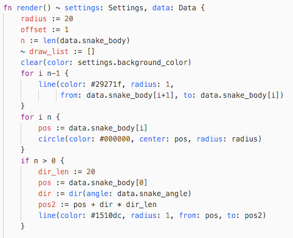

# dyon
A rusty dynamically typed scripting language

[Tutorial](http://www.piston.rs/dyon-tutorial/)  
[Dyon-Interactive](https://github.com/PistonDevelopers/dyon/tree/master/interactive)  
[Dyon Snippets](https://github.com/PistonDevelopers/dyon_snippets)  
[/r/dyon](https://www.reddit.com/r/dyon/)

Dyon script files end with `.dyon`.

To run Dyon script files from command line, type:

```
cargo install --example dyonrun dyon
```

Then, to run a script file you type:

```
dyonrun <file.dyon>
```

### Editor-plugins

[Dyon for the Atom Editor](https://github.com/PistonDevelopers/atom-language-dyon)  
[Dyon for the Vim Editor](https://github.com/thyrgle/vim-dyon)  



### List of features

- Array `arr := [a, b, c]` with lookup `arr[0]` and lookup with array of indices `arr[[0, 0]]`
- Object `obj := {x: a, y: b}`
- Number (f64) `n := 5.3`
- Boolean `t := true`
- [Link](https://github.com/PistonDevelopers/dyon/issues/227) `link { 1 2 "hi" false }`
- Custom Rust objects using `Arc<Mutex<Any>>`
- Functions without return `fn foo() { ... }` and with return `fn foo() -> { ... return x }`
- Functions as mathematical expresisons `f(x) = x / (x - 1)`
- [Optional namespaces with shared aliases](https://github.com/PistonDevelopers/dyon/issues/434) `ns program::example::test`
- [Lifetime checker](https://github.com/PistonDevelopers/dyon/issues/173) (no garbage collector is needed) `fn foo(mut a, b: 'a) { a.x = b }`
- [Mutability checker](https://github.com/PistonDevelopers/dyon/issues/112) `fn foo(mut a) { bar(mut a) }`
- [Return lifetime](https://github.com/PistonDevelopers/dyon/issues/173) `fn id(x: 'return) -> { return x }`
- [Checks type at runtime when mutating variable](https://github.com/PistonDevelopers/dyon/issues/19) `a = 2.0 // ERROR: Expected assigning to number`
- [Objects inserts new key](https://github.com/PistonDevelopers/dyon/issues/19) with `a.x := 0` and checks existence and type with `a.x = 0`
- [Named argument syntax](https://github.com/PistonDevelopers/dyon/issues/26) based on snake case `foo(bar: b)` is equal to `foo__bar(b)`
- If expression `a := if b < c { 0 } else { 1 }`
- For loop `for i := 0; i < 10; i += 1 { ... }`
- [Short For loop](https://github.com/PistonDevelopers/dyon/issues/116) `for i 10 { ... }`
- [Short For loop](https://github.com/PistonDevelopers/dyon/issues/116) with offset `for i [2, 10) { ... }`
- [Infer range from loop body](https://github.com/PistonDevelopers/dyon/issues/116) `for i { println(list[i]) }`
- [Packed loop](https://github.com/PistonDevelopers/dyon/issues/116) `for i, j { println(list[i][j]) }`
- [`∑`/`sum`, `∏`/`prod`, `min`, `max`, `sift`, `∃`/`any`, `∀`/`all` loops](https://github.com/PistonDevelopers/dyon/issues/119)
- [Secrets derived from loops](https://github.com/PistonDevelopers/dyon/issues/266) `why(any i { list[i] > 3 })`
- [Link loop](https://github.com/PistonDevelopers/dyon/issues/418)
- Infinite loop `loop { ... }`
- Unlabeled break `loop { break }`
- Unlabeled continue `loop { continue }`
- Labeled break `'a: loop { break 'a }`
- Labeled continue `'a: loop { continue 'a }`
- [Use `return` as a variable without exiting `return = 8`](https://github.com/PistonDevelopers/dyon/issues/169)
- [Dynamic modules](https://github.com/PistonDevelopers/dyon/issues/170) `m := unwrap(load("script.dyon"))` then `call(m, "main", [])`
- [Import to module prelude](https://github.com/PistonDevelopers/dyon/issues/170) `m := unwrap(load(source: "script.dyon", imports: [window, graphics]))`
- [Add a custom Rust function](https://github.com/PistonDevelopers/dyon/issues/171) using `Module::add`
- [Option values](https://github.com/PistonDevelopers/dyon/issues/172) with `none()` or `some(x)`
- [Result values](https://github.com/PistonDevelopers/dyon/issues/82) with `ok(x)` or `err(x)`
- `?` operator to propagate errors, e.g. `x := foo()?`, [maps option to result automatically](https://github.com/PistonDevelopers/dyon/issues/172)
- `unwrap(x)` [prints trace of propagated error](https://github.com/PistonDevelopers/dyon/issues/82)
- `functions()` returns sorted list of all available functions in a module
- [Optional type system](https://github.com/PistonDevelopers/dyon/issues/84) `fn could(list: []) -> f64`
- [Ad-hoc types](https://github.com/PistonDevelopers/dyon/issues/236) `fn players() -> [Player str] { ... }`
- [Current objects](https://github.com/PistonDevelopers/dyon/issues/224) `fn render() ~ world { ... }`
- [Go-like coroutines with `go`](https://github.com/PistonDevelopers/dyon/issues/163) `thread := go foo()`
- [In-types concurrency](https://github.com/PistonDevelopers/dyon/issues/495) `receiver := in foo`
- [Closures](https://github.com/PistonDevelopers/dyon/issues/314) `\(x) = x + 1`
- [Grab expressions](https://github.com/PistonDevelopers/dyon/issues/316) `\(x) = (grab a) + x`
- [4D vectors with `f32` precision `(x, y, z, w)`](https://github.com/PistonDevelopers/dyon/issues/144)
- [4D matrices with `f32` precision `mat4 {1,2,3,4; 5,6,7,8; 9,10,11,12; 13,14,15,16}`](https://github.com/PistonDevelopers/dyon/issues/557)
- [Un-loop for 4D vectors](https://github.com/PistonDevelopers/dyon/issues/201) `vec4 i f(i)`
- [Unpack 4D vectors](https://github.com/PistonDevelopers/dyon/issues/213) `f(xy v)`
- [Swizzle 4D vectors](https://github.com/PistonDevelopers/dyon/issues/213) `(yxz v, 1)`
- [HTML hex colors](https://github.com/PistonDevelopers/dyon/issues/167) `#fab3ee`
- [Meta parsing](https://github.com/PistonDevelopers/dyon/issues/168)
- [Macros for embedding in Rust](https://github.com/PistonDevelopers/dyon/blob/master/examples/functions.rs) `dyon_fn!{fn say_hello() { println!("hi!"); }}`

### Why the name Dyon?

Dyon is a hypothetical particle predicted by several grand unified theories in physics with both electrical and magnetic charge. See this [Wikipedia article](https://en.wikipedia.org/wiki/Dyon) for more information.

The name Dyon fits because, just like the particle, there are things that are yet to be discovered about language design.
However, this language was not born out of a grand new vision,
but is the result of exploring and testing new ideas.

### Motivation and goals

[Sven Nilsen](https://github.com/bvssvni/) started this project in early 2016.
The idea was to make a simple, but convenient scripting language that integrated well with Rust.

- During the first week of coding, a way to do lifetime checking on function arguments was discovered
- A different approach to code organization was explored by adding the ability to dynamically load modules
- For nice error handling, added option, result and `?` operator
- To test the design of the language, created a demo for interactive coding
- Mutability check to improve readability
- Short For loop to improve readability and performance
- Mathematical loops and Unicode symbols to improve readability
- Go-like coroutines to add multi-thread support
- 4D vectors with unpack and swizzle to make 2D and 3D programming easier
- Html hex colors to make copying colors from image editors possible
- Optional type system to help scaling a project
- Ad-hoc types for extra type safety
- Current objects to improve prototyping and tailored environments
- Macros for easier embedding with Rust
- Secrets to automatically derive meaning from mathematical loops
- Closures that can be printed out, use current objects and grab from closure environment
- Type safety for secrets, easy load/save of Dyon data
- Link loop for easier and faster code generation and templates
- In-types for easy cross thread communication

Main goals:

- Integrate well with Rust
- Flexible way of organizing code

Performance will be optimized for the cycle:

```
coding -> parsing -> running -> debugging -> coding
```

Sub goals:

- Safety

Non-goals:

- Rust equivalent performance
- Replace Rust to build libraries
- Interfacing with other languages than Rust

## License

Licensed under either of
 * Apache License, Version 2.0 ([LICENSE-APACHE](LICENSE-APACHE) or http://www.apache.org/licenses/LICENSE-2.0)
 * MIT license ([LICENSE-MIT](LICENSE-MIT) or http://opensource.org/licenses/MIT)
at your option.

### Contribution

Unless you explicitly state otherwise, any contribution intentionally submitted
for inclusion in the work by you shall be dual licensed as above, without any
additional terms or conditions.
