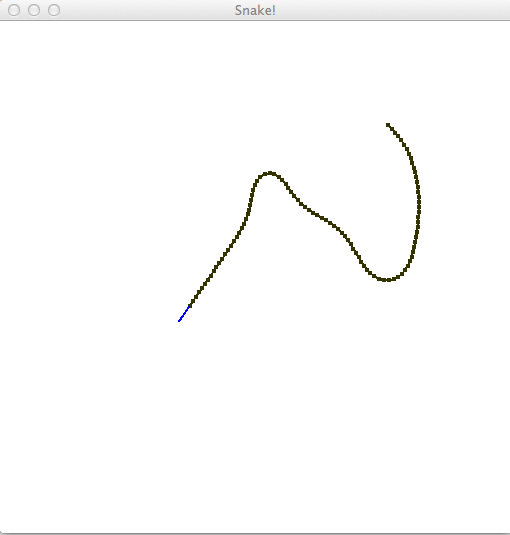

# dyon
A rusty dynamically typed scripting language

Notice: This is very early stage in development. Breaking changes will happen!



To run snake demo for interactive coding:

1. [Install Rust](https://www.rust-lang.org/) (Rust Nightly is required at the moment)
2. Fork the repo to your local hard drive
3. In Terminal, type `cargo run --release --example piston_window`
4. Edit "source/piston_window/snake.rs" while running the demo

Dyon uses ".rs" to get Rust syntax coloring.

### List of features

- Array `arr := [a, b, c]`
- Object `obj := {x: a, y: b}`
- Number (f64) `n := 5.3`
- Boolean `t := true`
- Custom Rust objects using `Arc<Mutex<Any>>`
- Functions without return `fn foo() { ... }`
- Functions with return `fn foo() -> { ... return x }`
- Functions as mathematical expresisons `f(x) = x / (x - 1)`
- Lifetime checker (no garbage collector is needed) `fn foo(mut a, b: 'a) { a.x = b }`
- Mutability checker `fn foo(mut a) { bar(mut a) }`
- Return lifetime `fn id(x: 'return) -> { return x }`
- Checks type at runtime when mutating variable `a = 2.0 // ERROR: Expected assigning to number`
- Objects inserts new key with `a.x := 0` and checks existence and type with `a.x = 0`
- Named argument syntax based on snake case `foo(bar: b)` is equal to `foo_bar(b)`
- If expression `a := if b < c { 0 } else { 1 }`
- For loop `for i := 0; i < 10; i += 1 { ... }`
- Short For loop `for i 10 { ... }`
- Short For loop with offset `for i [2, 10) { ... }`
- ∑`/`sum`, `min`, `max`, `sift`, `∃`/`any`, `∀`/`all` loops
- Infinite loop `loop { ... }`
- Unlabeled break `loop { break }`
- Unlabled continue `loop { continue }`
- Labeled break `'a: loop { break 'a }`
- Labeled continue `'a: loop { continue 'a }`
- Use `return` as a variable without exiting `return = 8`
- Dynamic modules `m := unwrap(load("script.dyon"))` then `call(m, "main", [])`
- Import to module prelude `m := unwrap(load(source: "script.dyon", imports: [window, graphics]))`
- Add a custom Rust function using `Module::add`
- Option values with `none()` or `some(x)`
- Result values with `ok(x)` or `err(x)`
- `?` operator to propagate errors, e.g. `x := foo()?`, maps option to result automatically
- `unwrap(x)` prints trace of propagated error
- `functions()` returns sorted list of all available functions in a module

### Why the name Dyon?

Dyon is a hypothetical particle predicted by several grand unified theories in physics with both eletrical and magnetic charge. See [wikipedia article](https://en.wikipedia.org/wiki/Dyon) for more information.

The name Dyon fits because, just like the particle, there are things that are yet to be discovered.
However, it was not born out of a grand new vision about language design,
but is the result of exploring and testing new stuff.

### Motivation and goals

[Sven Nilsen](https://github.com/bvssvni/) started this project in early 2016.
The idea was to make a simple, but convenient scripting language that integrated well with Rust.

- During the first week of coding, it was discovered a way to make a lifetime checking on arguments
- Dynamic modules with imported prelude were added to explore a different approach to organizing code
- For nice error handling, added option, result and `?` operator
- To test the design of the language, created a demo for interactive coding
- Mutability check to improve readability
- Short For loop to improve readability and performance
- Mathematical loops and unicode symbols as alternative syntax

Main goals:

- Integrate well with Rust
- Flexible way of organizing code

Performance will be optimized for the cycle:

```
coding -> parsing -> running -> debugging -> coding
```

Sub goals:

- Safety

Non-goals:

- Rust equivalent performance
- Replace Rust to build libraries
- Interfacing with other languages than Rust

## License

Licensed under either of
 * Apache License, Version 2.0 ([LICENSE-APACHE](LICENSE-APACHE) or http://www.apache.org/licenses/LICENSE-2.0)
 * MIT license ([LICENSE-MIT](LICENSE-MIT) or http://opensource.org/licenses/MIT)
at your option.

### Contribution

Unless you explicitly state otherwise, any contribution intentionally submitted
for inclusion in the work by you shall be dual licensed as above, without any
additional terms or conditions.
